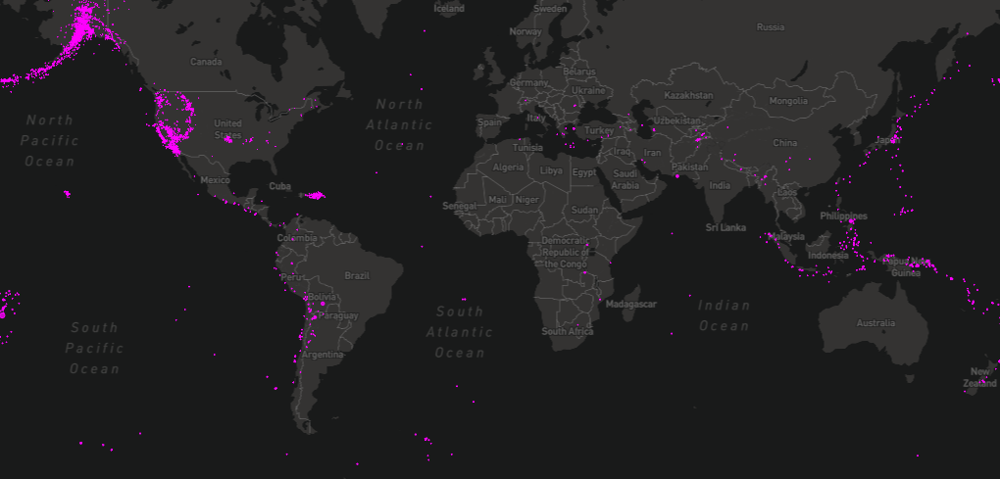

#QuakeMap



A little project demo I put together that visually plots earthquakes using data from USGS

##[Live Demo](https://visualquakemap.herokuapp.com/)

##Tech used:
- JavaScript
- P5.js
- REST API's
- Mapbox API

##Todo
- [x] implement basic functionality
- [x] add full screen functionality and "reponsiveness"
- [ ] optimize for mobile
- [ ] add refresh button
- [ ] add timelapse functionality
- [ ] implement backend to store past data
- [ ] enable clicking of earthquakes for more info
- [ ] implement deep learning to predict future earthquakes

##How you can use my source
1. add in your own config.js file to the root directory
  - It should look something like this:   
  ``` javascript
  mapimg = loadImage("https://api.mapbox.com/styles/v1/mapbox/dark-v9/static/" + clat + "," + clon + "," + zoom + ",0,0/" + mapWidth + "x" + mapWidth + "?access_token=" + process.env.MAPKEY);
  ```
  - Grab an api key [here](https://www.mapbox.com/studio/):
2. Thats it.......it's really that easy
